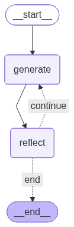

# Reflection Agent - Tweet Generator

A LangGraph-based reflection agent that generates and iteratively improves tweets through self-critique.

## Overview

This project implements a reflection agent pattern where:
1. A **generate** agent creates tweets about a given topic
2. A **reflect** agent critiques the generated tweet
3. The system iteratively improves the tweet based on feedback
4. The process continues until the tweet is satisfactory or max revisions are reached

## Architecture

### Components

- **chains.py**: Defines the LangChain prompts and chains
  - `generate_chain`: Tweet generation with influencer persona
  - `reflect_chain`: Tweet critique with detailed recommendations

- **main.py**: Core reflection agent workflow
  - `AgentState`: State management with `add_messages` reducer
  - `generate()`: Generates tweets using the generate_chain
  - `reflect()`: Critiques tweets using the reflect_chain
  - `should_continue()`: Smart termination logic based on quality keywords or max revisions

### Workflow



## Features

- **Message-based state** with `add_messages` reducer for automatic state management
- **Smart termination** - stops when critique contains satisfaction keywords
- **Configurable max revisions** - prevents infinite loops (default: 5)
- **Interactive CLI** - prompts for topic input
- **Rich output** - displays final tweet, critique, and statistics
- **Graph visualization** - generates workflow diagram (graph.png)

## Installation

```bash
# Create virtual environment
python -m venv .venv
source .venv/bin/activate  # On Windows: .venv\Scripts\activate

# Install dependencies
pip install -r requirements.txt
```

## Configuration

Create a `.env` file with your API keys:

```env
OPENAI_API_KEY=your-openai-api-key
LANGSMITH_API_KEY=your-langsmith-api-key  # Optional for tracing
LANGSMITH_TRACING=true
LANGSMITH_ENDPOINT=https://api.smith.langchain.com
LANGSMITH_PROJECT=default
```

## Usage

Run the reflection agent:

```bash
python main.py
```

The agent will:
1. Prompt you for a tweet topic
2. Generate an initial tweet
3. Critique the tweet
4. Iteratively improve based on feedback
5. Display the final tweet and statistics

## Example

```
============================================================
REFLECTION AGENT - Tweet Generator
============================================================

Enter a topic for the tweet: artificial intelligence

🚀 Starting reflection process for topic: 'artificial intelligence'
------------------------------------------------------------

↻ Tweet needs improvement. Revision 1/5

↻ Tweet needs improvement. Revision 2/5

✓ Tweet is satisfactory after 3 revision(s)!

============================================================
FINAL RESULTS
============================================================

Final Tweet:
AI is transforming our world faster than ever! From healthcare to creativity,
it's unlocking human potential in ways we never imagined. The future is here.
#AI #Innovation #TechTrends

Tweet Length: 187 characters

Final Critique:
STATUS: SATISFACTORY
This tweet effectively captures the excitement around AI...

Total Revisions: 3
Message History Length: 7 messages

============================================================
```

## Customization

### Adjust Max Revisions

Modify in `main.py`:
```python
initial_state: AgentState = {
    "messages": [...],
    "revision_count": 0,
    "max_revisions": 5,  # Change this value
}
```

### Modify Prompts

Edit `chains.py` to customize the generation and reflection prompts.

### Change Termination Keywords

Update `should_continue()` in `main.py`:
```python
for keyword in ["satisfactory", "excellent", "perfect", "great job"]:
```

## Graph Visualization

The workflow graph is automatically saved as `graph.png` when running the agent.

## Tech Stack

- **LangChain**: Prompt templates and chains
- **LangGraph**: State graph workflow orchestration
- **OpenAI**: GPT-4o-mini for generation and reflection
- **Python**: 3.13+

## License

MIT
